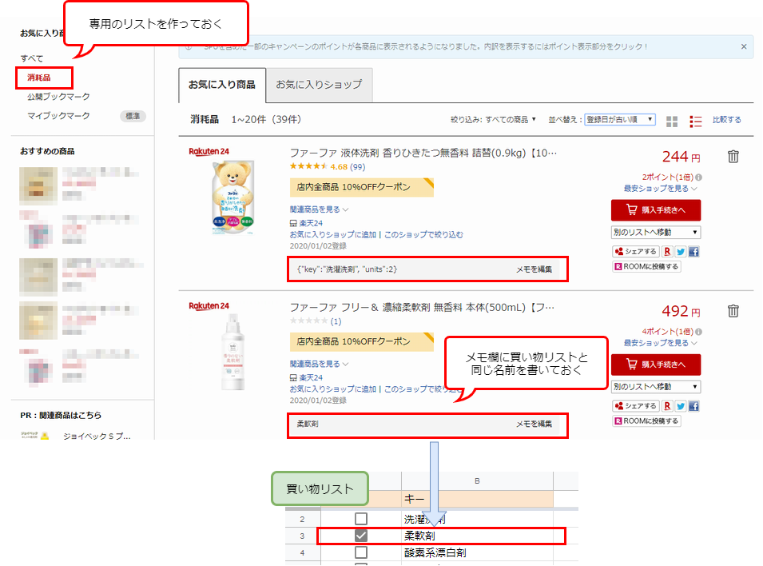

# js-rakuten-order
日用品を楽天で検索してカートに入れる

# 機能概要

1. Google スプレッドシートで作成しておいた買い物リストを開く。
1. 楽天市場にログインする。
1. 買い物リストから、チェックが入っているものを読み取る。
1. 楽天市場のお気に入りリストを開き、メモ欄を使って買い物リストと一致するものを探す。
1. 一致するものが見つかった場合、商品をカートに入れる。
1. カートに入れることができたものは、買い物リストのチェックマークを外す。

このスクリプトでは、商品をカートに入れるが注文はしない。カートの内容の確認や数量の調整などをしたあと、自分で決済する必要がある。
楽天の場合、ログインしてからカートへの追加をすればブラウザを閉じてもカートの情報が保存されるため、スクリプト実行後に自分で楽天市場へアクセスし、上記の流れで作業することが可能。

# 準備

## 設定ファイルを作成する

```json:config/default.json
{
    "rakuten" : {
        "user_id" : ""
        , "password" : ""
        , "bookmark" : {
            "url" : "https://my.bookmark.rakuten.co.jp/item/xxxx"
        }
    }
    , "spreadsheet" : {
         "id" : "スプレッドシートのID"
        , "todo" : {
            "sheetName":"買い物リスト"
            ,"range":"A2:B"
        }
    }
    , "chrome" : {
        "executablePath" : "C:/Program Files (x86)/Google/Chrome/Application/chrome.exe"
    }
}
```

## 買い物リストを作る
Google スプレッドシートで買い物リストを作っておく。チェックリスト形式にして、買いたいものにチェックを入れる方式で運用する。


作成したら、このスプレッドシートのIDを取得して設定ファイルに書いておく。スプレッドシートIDは、アドレスバーからコピーできる。


## Sheets API用の認証ファイルを用意する
Google スプレッドシートにはSheets APIを使用してアクセスするため、OAuth認証用の`credentials.json`がプロジェクトルートに必要。
手順は「[【Node.js + Sheets API v4】Googleスプレッドシートを読み書きする - Qiita](https://qiita.com/vicugna-pacos/items/f7bb0d97bbaa1371edc8)」参照。

## お気に入りリストを作る
楽天市場でお気に入りリストを作っておく。このスクリプト用のリストを作り、商品をお気に入りに登録したら、メモ欄に買い物リストと同じ名前を書いておいて、買い物リストと商品を結びつける。



メモ欄には単純に「柔軟剤」と書いても良いが、JSON形式で書けるようにもしている。その場合の書き方は以下の通り：

* `key` - 買い物リストと結びつける名前
* `units` - カートに入れる数。省略可能。既定値：1。


# 買い物リストがGoogle スプレッドシートである理由
リストをあらかじめ作成しておき、必要なものにチェックマークを付ける方式で運用したかったため。
Googleであれば、Keepに似たような機能があるが、KeepにはAPIが存在しない。それではとpuppeteerでアクセスも試したが、botと感知されるせいかログインができなかったため、不採用とした。
そのほかのサービスについては、このためだけに会員登録することは避けたかったため試行さえもしていない。
