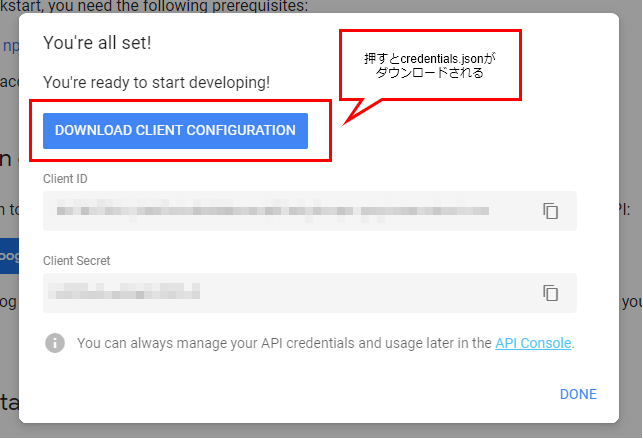

---
title:【Node.js】Googleスプレッドシートとpuppeteerで日用品の買い物を自動化
---
# はじめに
洗剤やトイレットペーパーなど、日常の消耗品の買い物は楽天で通販しているのですが、買い物リストをもとに目的の商品を検索してカートに入れる作業が面倒くさかったので、自動化しました。

# 概要

1. Googleスプレッドシートに、買い物リストのシートと商品リストのシートを作成。
1. 買い物リストを見て、欲しいものにチェックを入れる。
2. 商品リストには、実際に買う商品の情報を書いておく。「洗濯洗剤」であれば、どこの商品でどのお店で買うか、など。
3. Node.jsでスクリプトを作成する。買い物リストと商品リストを読み込み、puppeteerで楽天を開き、チェックの入った商品を検索しつつカートに入れる。
4. カートに入れることができたものについては、買い物リストのチェックを外す。

以上が自動化の流れです。
カートに入れたものが正しいか確認する意味も含め、実際の注文は手作業でやるように残しています。楽天市場では、ログオンした状態でカートに入れた商品は、ブラウザを閉じても(Cookieが消えても)アカウントに記憶されているので、楽天市場を開いたときにまずログオンしています。

Node.js v10.16.0
Google Sheets API v4
Visual Studio Code

# 買い物リストと商品リストの用意

私の場合、洗濯洗剤はコレ…とどの商品を買うかが決まっています。なおかつ、消耗品は定期的に買うものなので、最初から買い物リストを作成しておいて、「買うかどうか」のフラグを立てる形式にしたかったので、両方ともGoogleスプレッドシートに作成しました。


# GoogleスプレッドシートにAPIでアクセスする

## 準備

[Node.js Quickstart  |  Sheets API  |  Google Developers](https://developers.google.com/sheets/api/quickstart/nodejs)

上記サイトを参考に、まず Google Sheets API を使えるようにする。「Enable the Google Sheets API」のボタンを押してしばらく待つと、Client IDやシークレットと共に、設定ファイルをダウンロードするボタンが出てくるので、それを押す。



ダウンロードした`credentials.json`は、プロジェクトのルートフォルダなど扱いやすい場所に置く。ダウンロードしそこねた場合は、Developer Console→認証情報からダウンロードできる。
`credentials.json`をソース管理対象外にして、うっかりコミットすることを防いでおく。

## Visual Studio Code で readline を使えるようにする
Quickstartのサンプルでは、OAuthトークンをreadlineで受け取ろうとしている。しかし、Visual Studio Codeのコンソールは出力専用なので、入力の受け取りができない。このままではデバッグ時に不便なので、launch.jsonの設定を変え、コンソールを外部のものにする必要がある。

launch.jsonを開くには、メニューの「デバッグ」→「構成を開く」を選ぶ。


launch.jsonに以下を追加する。

```
"console": "externalTerminal"
```


## Google APIs Node.js Client

[Google APIs Node.js Client](https://github.com/googleapis/google-api-nodejs-client#google-apis-nodejs-client)

Quickstartでも使っているGoogle製のライブラリ。
Sheets APIについては、サンプルがほとんどなかったり、ドキュメントが恐ろしく分かりづらかったりする。

# puppeteerで商品検索～カートへ追加
