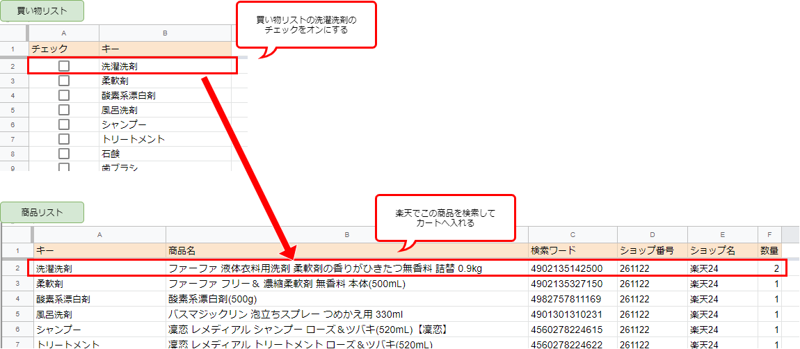
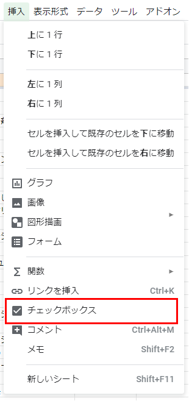

---
title:【Node.js】Googleスプレッドシートとpuppeteerで日用品の買い物を自動化
---
# はじめに
洗剤やトイレットペーパーなど、日常の消耗品の買い物は楽天で通販しているが、メモアプリに書いた買い物リストをもとに、目的の商品を検索してカートに入れる作業が面倒くさかったので自動化した。

# 概要

1. Googleスプレッドシートに、買い物リストのシートと商品リストのシートを作成しておく。
1. 買い物リストを見て、欲しいものにチェックを入れる。
2. 商品リストには、実際に買う商品の情報を書いておく。「洗濯洗剤」であれば、どこの商品でどのお店で買うか、など。
3. Node.jsでスプレッドシートを読み込み、puppeteerで楽天を開き、チェックの入った商品を検索しつつカートに入れる。
4. カートに入れることができたものについては、買い物リストのチェックを外す。

カートに入れたものが正しいか確認する意味も含め、実際の注文は手作業でやるように残している。楽天市場では、ログオンした状態でカートに入れた商品は、ブラウザを閉じても(Cookieが消えても)アカウントに記憶されているので、楽天市場を開いたときにまずログオンしている。

使うもの：

* Node.js v10.16.0
* Google Sheets API v4
* Visual Studio Code

# 買い物リストと商品リストの用意

私の場合、洗濯洗剤はコレ…とどの商品を買うかが決まっていて、なおかつ、消耗品は定期的に買うものなので、洗剤が無くなる度にメモに「洗剤」と書くのではなく、最初から買い物リストを作成しておいて、「買うかどうか」のフラグを立てる形式にしたかった。



Googleスプレッドシートでは、セルをチェックボックスにすることができる。目的のセルを選択した状態で、メニューの「挿入」→「チェックボックス」を選択すればOK。



こうするとセルにチェックボックスが表示され、チェックを入れたり外したりすると、値が`TRUE`または`FALSE`へと変化するようになる。

一方、商品リストは、楽天で検索するために必要なのは以下の3つ：

* 検索ワード - 目的の商品が見つかりそうなワード。商品名でも良いが、ショップが商品に対して付けている管理番号の方が確実な場合がある。
* ショップ番号 - 検索するショップを指定する。ショップ内で検索したときのURLに現れるsid。<br> 
* 数量 - 一度にカートに入れる数量。

そのほかの「商品名」などの列は、自分で見て分かりやすいように追加した。

# GoogleスプレッドシートにAPIでアクセスする

## 準備

[Node.js Quickstart  |  Sheets API  |  Google Developers](https://developers.google.com/sheets/api/quickstart/nodejs)

上記サイトを参考に、まず Google Sheets API を使えるようにする。「Enable the Google Sheets API」のボタンを押してしばらく待つと、Google Cloud Platformにプロジェクトが作成され、Client IDやシークレットと共に設定ファイルをダウンロードできるようになる。


ダウンロードした`credentials.json`は、Node.jsプロジェクトのルートフォルダなど扱いやすい場所に置く。ダウンロードしそこねた場合は、Developer Console→認証情報からダウンロードできる。
`credentials.json`をソース管理対象外にして、うっかりコミットすることを防いでおく。

## Visual Studio Code で readline を使えるようにする
Quickstartのサンプルでは、OAuthトークンをreadlineで受け取ろうとしている。しかし、Visual Studio Codeのコンソールは出力専用なので、入力の受け取りができない。このままではデバッグ時に不便なので、launch.jsonの設定を変え、コンソールを外部のものにする必要がある。

launch.jsonを開くには、メニューの「デバッグ」→「構成を開く」を選ぶ。


launch.jsonに以下を追加する。

```
"console": "externalTerminal"
```


これでデバック実行時にコマンドプロンプトが起動するようになり、コンソール入力の受け取りが可能になる。

## Google APIs Node.js Client

Quickstartでも使っているGoogle製のライブラリ。セルの取得や更新ができる…が、ドキュメントがちょっと説明不足な気がする。

### 認証


### セルの取得


# puppeteerで商品検索～カートへ追加
